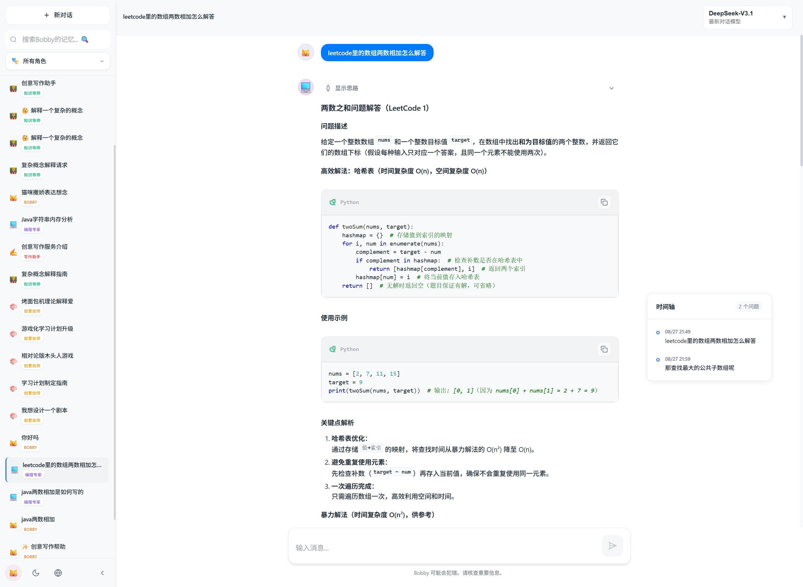
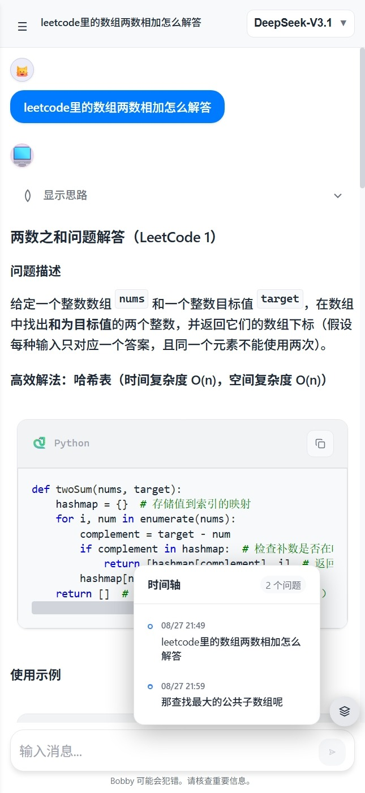

# Bobby

一个基于React构建的AI聊天应用，支持多种AI模型

## 功能特性

### 核心功能
- 响应式设计，支持PC端和移动端（移动端UI优化中）
- 本地数据存储，聊天历史自动保存
- 多对话管理，支持创建、切换、删除对话
- 优美的流式输出
- Markdown支持，AI回复支持代码高亮、表格、列表等格式
- 硅基流动API集成（更多供应商适配开发中）

### 高级功能
- 🔍 智能搜索历史对话内容
- 📚 知识库系统，支持文档上传和语义搜索
- ⚙️ 可视化API配置界面
- 🌓 主题系统，支持明亮模式和暗色模式
- 🌍 多语言支持，中文和英文界面
- 📝 消息操作，支持复制和重新生成
- 🕒 对话时间轴，快速预览和跳转到历史问题
- 🎭 多角色对话，支持不同AI角色切换
- 💭 推理过程显示，展示AI思考过程

## 界面展示

### PC端界面


### 移动端界面


## 快速开始

### 1. 安装依赖

```bash
pnpm install
```

### 2. 配置API

首次使用时需要配置API：

1. 启动应用后，点击右上角的设置按钮
2. 系统默认配置硅基流动API服务
3. 输入API密钥
4. 选择合适的AI模型
5. 点击"测试连接"验证配置
6. 保存设置开始使用

### 3. 知识库功能配置（可选）

知识库功能现在完全使用远程硅基流动API，无需下载本地模型：

#### 功能特点
- **零配置**: 无需下载任何本地模型文件
- **云端处理**: 所有嵌入向量生成通过硅基流动API完成
- **多语言支持**: 自动检测语言并选择合适的嵌入模型
- **高性能**: 依赖云端GPU加速，处理速度快

#### 支持的嵌入模型
- **BAAI/bge-m3**: 默认多语言模型，支持中英文混合内容
- **BAAI/bge-large-zh-v1.5**: 中文专用模型
- **BAAI/bge-large-en-v1.5**: 英文专用模型
- **自动选择**: 系统根据文本内容自动选择最适合的模型

### 4. 启动应用

```bash
pnpm start
```

应用将在 http://localhost:3000 启动。

## API配置说明

### 硅基流动API (默认)

项目使用硅基流动API服务，提供对话模型和嵌入模型：

#### 支持的模型类型
- **对话模型**:
  - 最新模型 - DeepSeek-V3.1、Step-3等
  - 通义千问3系列 - Qwen3系列模型
  - 推理模型 - DeepSeek-R1等
  - 对话模型 - 各种对话优化模型
  - 通义千问2.5系列 - Qwen2.5系列模型

- **嵌入模型** (用于知识库功能):
  - BAAI/bge-m3 - 默认多语言模型
  - BAAI/bge-large-zh-v1.5 - 中文专用模型
  - BAAI/bge-large-en-v1.5 - 英文专用模型

#### 配置示例
```javascript
{
  baseURL: 'https://api.siliconflow.cn/v1/chat/completions',
  apiKey: 'YOUR_SILICONFLOW_API_KEY',
  model: 'deepseek-ai/DeepSeek-V3.1',
  temperature: 0.7,
  maxTokens: 2000
}
```

### 推荐模型
- DeepSeek-V3.1 - 最新对话模型
- DeepSeek-R1 - 高级推理模型
- Qwen3系列 - 编程专用模型
- Pro版本 - 性能更强

## 项目结构

```
src/
├── components/          # React组件
│   ├── ChatInterface.js # 主聊天界面
│   ├── Sidebar.js       # 侧边栏
│   ├── MessageList.js   # 消息列表
│   ├── MessageInput.js  # 消息输入框
│   ├── Settings.js      # 设置面板
│   ├── WelcomeScreen.js # 欢迎界面
│   └── LanguageToggle.js # 语言切换
├── utils/              # 工具函数
│   ├── api.js          # API调用
│   ├── storage.js      # 本地存储
│   ├── language.js     # 多语言支持
│   ├── roles.js        # 角色配置
│   └── theme.js        # 主题管理
├── styles/             # 样式文件
│   └── theme.css       # 主题样式
├── App.js              # 主应用组件
└── index.js            # 应用入口
```

## 使用指南

### 基本操作
- 新建对话: 点击"新建聊天"按钮
- 发送消息: 输入内容后按Enter或点击发送按钮
- 切换对话: 点击侧边栏中的对话项
- 删除对话: 悬停对话项，点击删除按钮
- 复制消息: 点击消息下方的复制按钮

### 知识库功能
知识库系统支持文档上传和语义搜索，让AI能够基于你的文档内容回答问题。

#### 支持的文档格式
- **PDF文档**: 自动解析PDF内容
- **Word文档**: 支持.docx格式
- **Excel表格**: 支持.xlsx、.xls、.csv格式
- **文本文件**: 支持.txt格式
- **手动输入**: 直接输入文本内容

#### 使用步骤
1. **配置API**: 确保已配置硅基流动API密钥
2. **上传文档**: 点击知识库界面的上传按钮，选择或拖拽文档
3. **等待处理**: 系统会自动解析文档并通过远程API生成向量索引
4. **开始搜索**: 在聊天中提问，AI会基于知识库内容回答

#### 智能模型选择
- **自动语言检测**: 系统自动检测文档语言
- **多语言支持**: 支持中英文混合文档处理
- **云端优化**: 利用硅基流动的云端GPU加速处理
- **无需本地资源**: 不占用本地存储空间和计算资源

### 高级功能

#### 🔍 智能搜索
- 在搜索框输入关键词查找历史对话
- 支持搜索对话标题和消息内容
- 匹配的关键词会高亮显示

#### 🕒 对话时间轴
- **快速预览**: 右侧时间轴显示所有用户问题
- **一键跳转**: 点击时间轴项目直接跳转到对应位置
- **智能显示**: PC端常驻显示，移动端按钮控制
- **优雅交互**: 支持点击外部关闭（移动端）
- **响应式设计**: 自动适配不同屏幕尺寸

#### 📱 侧边栏管理
- 展开状态: 显示完整对话列表和搜索功能
- 收起状态: 只显示图标，节省屏幕空间（仅PC端）
- 智能分组: 按"今天"和"之前"自动分组

#### ⚙️ 设置面板
- API配置: 可视化配置界面
- 模型选择: 丰富的模型列表，按类型分类
- 连接测试: 一键测试API连接状态
- 参数调节: 调整温度、最大令牌数等参数

#### 🎭 多角色对话
- 角色切换: 支持不同AI角色（程序员、教师、创意助手等）
- 角色筛选: 按角色类型筛选历史对话
- 角色标签: 每个对话显示对应的角色标识

#### 💭 推理过程显示
- 思考过程: 可选择性显示AI的推理过程
- 步骤展示: 清晰的思考步骤展示
- 优雅UI: 简洁的推理过程界面设计

#### 🌓 主题系统
- 明亮模式: 适合白天使用
- 暗色模式: 适合夜间使用
- 自动切换: 根据系统主题自动切换

#### 🌍 多语言支持
- 中文界面: 默认中文界面
- 英文界面: 支持英文界面切换
- 实时切换: 无需刷新页面即可切换语言

### 📱 移动端适配
- 侧边栏会自动隐藏
- 点击左上角的按钮可打开/关闭侧边栏
- 触摸友好的界面设计
- 适配各种屏幕尺寸
- 时间轴按钮控制显示
- 优化的移动端交互体验

### 数据存储
- 聊天记录保存在浏览器的localStorage中
- API配置和用户设置同样本地保存
- 数据完全存储在本地

## 界面特性

### 消息显示
- 用户消息: 左对齐显示
- AI回复: 支持Markdown格式，代码高亮
- 消息操作: 复制和重新生成按钮
- 头像系统: 统一的头像样式

### 输入体验
- 自动展开: 输入框根据内容自动调整高度
- 快捷键: 支持Enter发送，Shift+Enter换行

## 自定义配置

### 修改主题颜色
编辑 `src/styles/theme.css` 文件中的CSS变量：
```css
:root {
  --accent-color: #10a37f;
  --bg-primary: #ffffff;
  --text-primary: #1a1a1a;
  /* 更多颜色变量... */
}
```

### 添加新功能
项目采用模块化设计，可以轻松添加新功能：
- 在 `components/` 目录下添加新组件
- 在 `utils/` 目录下添加工具函数
- 修改 `App.js` 集成新功能


## 注意事项

1. **API密钥安全**: 请不要将API密钥提交到公共代码仓库
2. **网络要求**: 需要稳定的网络连接访问硅基流动API
3. **API配额**: 知识库功能会消耗API配额，请留意使用量
4. **浏览器兼容性**: 建议使用现代浏览器
5. **存储限制**: localStorage有存储大小限制
6. **模型限制**: 嵌入模型和对话模型共享API配额

## 构建部署

```bash
# 构建生产版本
pnpm run build

# 构建完成后，dist目录包含可部署的静态文件
```

## 许可证

Creative Commons Attribution-NonCommercial-ShareAlike 4.0 International License

本项目采用知识共享署名-非商业性使用-相同方式共享 4.0 国际许可协议。

### 许可证特点
- 非商业性 - 禁止商业使用
- 署名要求 - 使用时必须注明原作者
- 强制开源 - 衍生作品必须以相同许可证发布
- 个人自由 - 可以自由进行个人使用

## 更新日志

### 最新版本 ✨
- 🚀 **重大升级**: 移除本地嵌入模型，完全使用远程硅基流动API
- 💾 **存储优化**: 无需下载本地模型文件，节省2.4GB+存储空间
- ⚡ **性能提升**: 依赖云端GPU加速，文档处理速度更快
- 🌐 **多语言增强**: 支持中英文混合文档的智能处理
- 🔄 **架构简化**: 移除candle相关依赖，降低编译复杂度
- 🕒 新增对话时间轴功能，支持快速预览和跳转
- 🎭 新增多角色对话系统，支持角色切换和筛选
- 💭 新增推理过程显示功能，展示AI思考过程
- 📱 优化移动端界面和交互体验
- 🌓 完善主题系统，支持明暗模式切换
- 🌍 完善多语言支持，中英文界面切换
- ⚙️ 优化设置面板和模型选择界面
- 🔍 优化搜索功能和侧边栏管理
