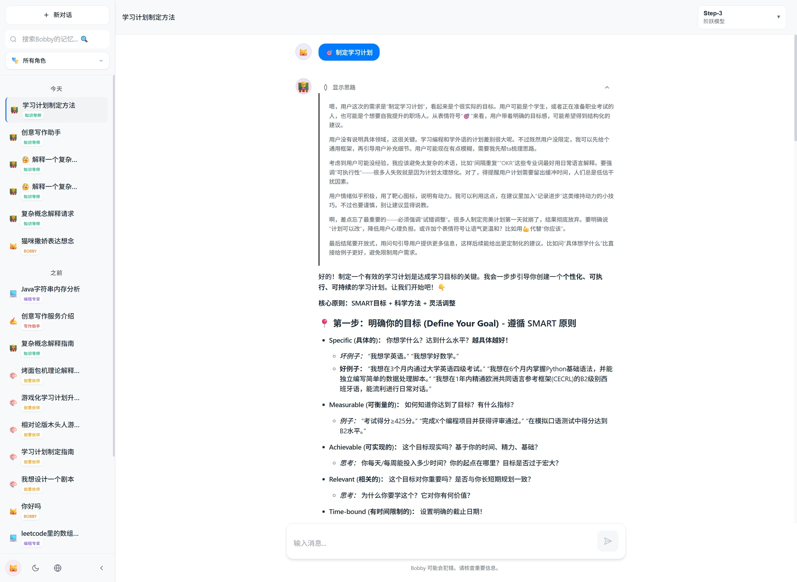

# Bobby

一个基于React构建的AI聊天应用，支持多种AI模型

## 功能特性

### 核心功能
- 响应式设计，支持PC端和移动端（移动端UI优化中）
- 本地数据存储，聊天历史自动保存（本地存储方案开发中，初期版本存localstorage）
- 多对话管理，支持创建、切换、删除对话
- 优美的流式输出
- Markdown支持，AI回复支持代码高亮、表格、列表等格式
- 硅基流动API集成（更多供应商适配开发中）

### 高级功能
- 智能搜索历史对话内容
- 可视化API配置界面
- 主题系统，支持明亮模式和暗色模式
- 多语言支持，中文和英文界面（英文适配待更新）
- 消息操作，支持复制和重新生成

## 界面展示



## 快速开始

### 1. 安装依赖

```bash
pnpm install
```

### 2. 配置API

首次使用时需要配置API：

1. 启动应用后，点击右上角的设置按钮
2. 系统默认配置硅基流动API服务
3. 输入API密钥
4. 选择合适的AI模型
5. 点击"测试连接"验证配置
6. 保存设置开始使用

### 3. 启动应用

```bash
pnpm start
```

应用将在 http://localhost:3000 启动。

## API配置说明

### 硅基流动API (默认)

项目使用硅基流动API服务，提供多种模型选择：

#### 支持的模型类型
- 最新模型 - DeepSeek-V3.1、Step-3等
- 通义千问3系列 - Qwen3系列模型
- 推理模型 - DeepSeek-R1等
- 对话模型 - 各种对话优化模型
- 通义千问2.5系列 - Qwen2.5系列模型

#### 配置示例
```javascript
{
  baseURL: 'https://api.siliconflow.cn/v1/chat/completions',
  apiKey: 'YOUR_SILICONFLOW_API_KEY',
  model: 'deepseek-ai/DeepSeek-V3.1',
  temperature: 0.7,
  maxTokens: 2000
}
```

### 推荐模型
- DeepSeek-V3.1 - 最新对话模型
- DeepSeek-R1 - 高级推理模型
- Qwen3系列 - 编程专用模型
- Pro版本 - 性能更强

## 项目结构

```
src/
├── components/          # React组件
│   ├── ChatInterface.js # 主聊天界面
│   ├── Sidebar.js       # 侧边栏
│   ├── MessageList.js   # 消息列表
│   ├── MessageInput.js  # 消息输入框
│   ├── Settings.js      # 设置面板
│   ├── WelcomeScreen.js # 欢迎界面
│   └── LanguageToggle.js # 语言切换
├── utils/              # 工具函数
│   ├── api.js          # API调用
│   ├── storage.js      # 本地存储
│   ├── language.js     # 多语言支持
│   ├── roles.js        # 角色配置
│   └── theme.js        # 主题管理
├── styles/             # 样式文件
│   └── theme.css       # 主题样式
├── App.js              # 主应用组件
└── index.js            # 应用入口
```

## 使用指南

### 基本操作
- 新建对话: 点击"新建聊天"按钮
- 发送消息: 输入内容后按Enter或点击发送按钮
- 切换对话: 点击侧边栏中的对话项
- 删除对话: 悬停对话项，点击删除按钮
- 复制消息: 点击消息下方的复制按钮
- 重新生成: 点击重新生成按钮获取新的回复

### 高级功能

#### 智能搜索
- 在搜索框输入关键词查找历史对话
- 支持搜索对话标题和消息内容
- 匹配的关键词会高亮显示

#### 侧边栏管理
- 展开状态: 显示完整对话列表和搜索功能
- 收起状态: 只显示图标，节省屏幕空间（仅PC端）
- 智能分组: 按"今天"和"之前"自动分组

#### 设置面板
- API配置: 可视化配置界面
- 模型选择: 丰富的模型列表，按类型分类
- 连接测试: 一键测试API连接状态
- 参数调节: 调整温度、最大令牌数等参数

#### 主题系统
- 明亮模式: 适合白天使用
- 暗色模式: 适合夜间使用
- 自动切换: 根据系统主题自动切换

#### 多语言支持
- 中文界面: 默认中文界面
- 英文界面: 支持英文界面切换
- 实时切换: 无需刷新页面即可切换语言

### 移动端适配
- 侧边栏会自动隐藏
- 点击左上角的按钮可打开/关闭侧边栏
- 触摸友好的界面设计
- 适配各种屏幕尺寸

### 数据存储
- 聊天记录保存在浏览器的localStorage中
- API配置和用户设置同样本地保存
- 数据完全存储在本地

## 界面特性

### 消息显示
- 用户消息: 左对齐显示
- AI回复: 支持Markdown格式，代码高亮
- 消息操作: 复制和重新生成按钮
- 头像系统: 统一的头像样式

### 输入体验
- 自动展开: 输入框根据内容自动调整高度
- 快捷键: 支持Enter发送，Shift+Enter换行

## 自定义配置

### 修改主题颜色
编辑 `src/styles/theme.css` 文件中的CSS变量：
```css
:root {
  --accent-color: #10a37f;
  --bg-primary: #ffffff;
  --text-primary: #1a1a1a;
  /* 更多颜色变量... */
}
```

### 添加新功能
项目采用模块化设计，可以轻松添加新功能：
- 在 `components/` 目录下添加新组件
- 在 `utils/` 目录下添加工具函数
- 修改 `App.js` 集成新功能


## 注意事项

1. API密钥安全：请不要将API密钥提交到公共代码仓库
2. 浏览器兼容性：建议使用现代浏览器
3. 存储限制：localStorage有存储大小限制
4. 网络要求：需要稳定的网络连接访问API

## 构建部署

```bash
# 构建生产版本
pnpm run build

# 构建完成后，dist目录包含可部署的静态文件
```

## 许可证

Creative Commons Attribution-NonCommercial-ShareAlike 4.0 International License

本项目采用知识共享署名-非商业性使用-相同方式共享 4.0 国际许可协议。

### 许可证特点
- 非商业性 - 禁止商业使用
- 署名要求 - 使用时必须注明原作者
- 强制开源 - 衍生作品必须以相同许可证发布
- 个人自由 - 可以自由进行个人使用

## 更新日志

### 最新版本
- 优化模型选择下拉框
- 修复下拉框遮挡问题
- 统一头像样式
- 优化移动端布局
- 完善多语言支持
